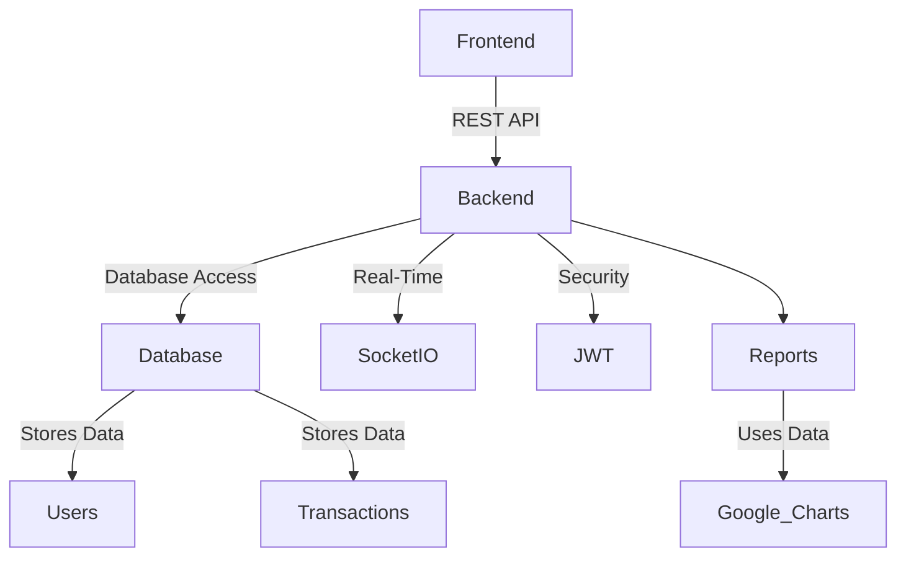

# 🏢 Business Collaboration Management System (MERN Stack)  

🚀 **A role-based access management system for Sales, Purchase, and HR departments with real-time chat, reports, and secure authentication.**  

## 📌 Features  

### 🔐 **Authentication & Security**  
- JWT-based authentication (Login, Register, Role-Based Access)  
- Auto-delete chat for security (Real-time using Socket.io)  
- Secure document sharing  

### 🎯 **Role-Based Access Control**  
👨‍💼 **Admin**: Full access (Users, Reports, Sales, Purchases, HR, etc.)  
🛒 **Sales Manager**: Sales reports (Google Charts), record sales, manage customers, chat with active users  
📦 **Purchase Manager**: Manage purchases, suppliers, and reports (Google Charts), chat with active users  
👥 **HR Manager**: Employee management, attendance tracking, training assignments, job posting, chat with employees  
👨‍💻 **Employees**: View assigned tasks, attendance, training progress, and communicate with their department  

### 📊 **Reports & Dashboards**  
- Sales, Purchase, Profit & Loss (Google Charts)  
- HR Dashboard (Attendance, Training, Task Reports)  
- Department-wise analytics  

### 💬 **Real-Time Chat**  
- Secure chat within respective departments (Socket.io)  
- Messages auto-delete upon disconnection  

### 📂 **Modules & Management**  
- **Sales Module**: Track sold items, manage customers  
- **Purchase Module**: Manage purchases and suppliers  
- **HR Module**: Employee attendance, training & development  
- **Task Management**: Assign & track department-specific tasks  

## 🛠️ Tech Stack  

| Stack        | Technologies Used |
|-------------|-----------------|
| **Frontend** | React.js, Redux, CSS |
| **Backend** | Node.js, Express.js |
| **Database** | MongoDB |
| **Real-time** | Socket.io |
| **Authentication** | JWT (JSON Web Tokens) |

## 📌 System Architecture  


🚀 **Getting Started**

## 🔧 Installation

### 1️⃣ Clone the Repository

```sh
git clone https://github.com/ritik88961-sudo/BCMS_Using_MERN
cd BCMS_Using_MERN
```

### 2️⃣ Install Dependencies

```sh
# Backend
cd BCMS_Backend
npm install

# Frontend
cd BCMS_frontend
npm install
```

### 3️⃣ Import Database Data
Before running the application, import the database data that was exported using `mongodump`:

```sh
mongorestore --uri="your_mongodb_connection_string" --drop BCMS_Backend/DB/bcms
```

### 4️⃣ Set Up Environment Variables
Create a `.env` file in the `backend` directory and add:

```env
MONGO_URI=your_mongodb_connection_string
JWT_SECRET=your_secret_key
```

### 5️⃣ Run the Application

```sh
# Start Backend Server
cd BCMS_Backend
node app.js

# Start Frontend
cd BCMS_Frontend
npm run dev
```
